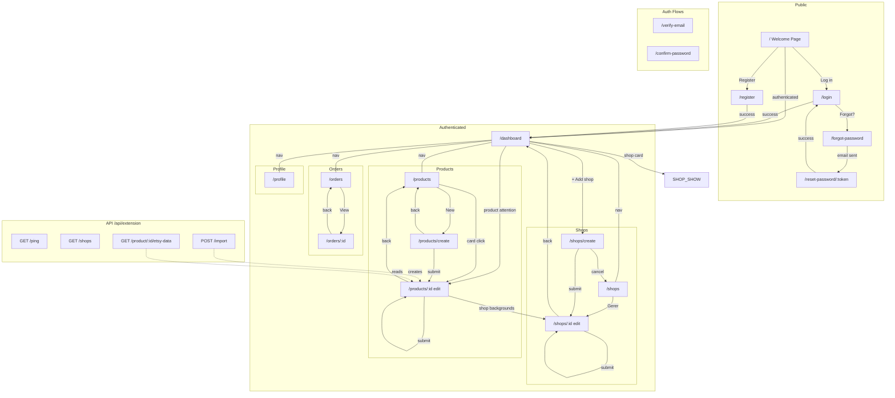
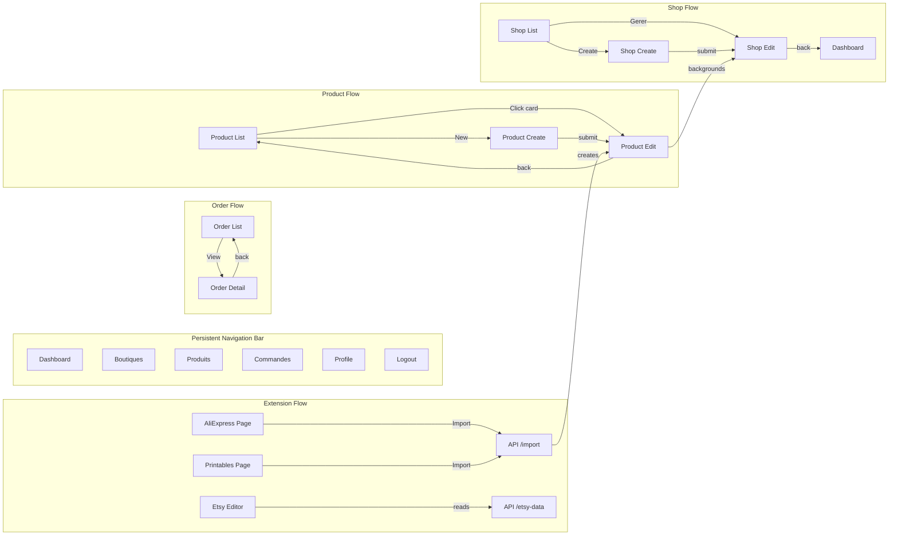
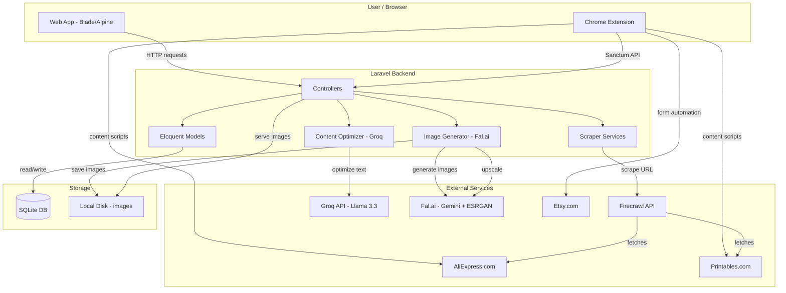
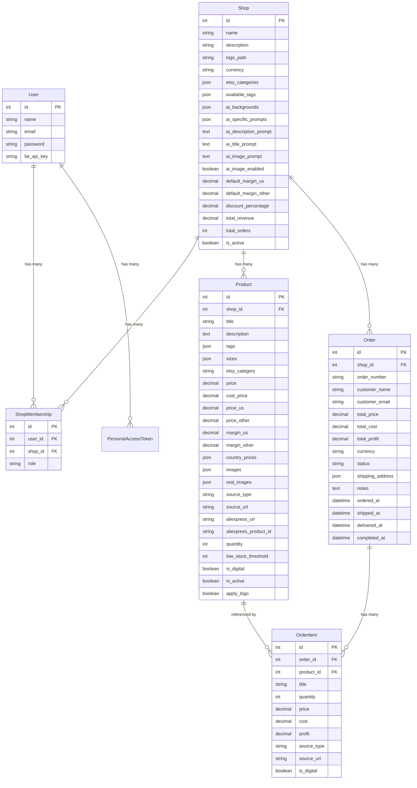

# LesRats - Application Audit & Sitemap

> **Date:** February 2026  
> **Purpose:** Technical debt audit for SaaS launch (March 2026 target)

---

## 1. Page Sitemap

---

## 2. Features Per Page

### `/dashboard` - Main Dashboard

| Feature | Status | Notes |
|---------|--------|-------|
| Aggregate stats (products, orders, revenue, profit) | OK | |
| Today's stats (orders, revenue) | OK | |
| Per-shop summary cards | OK | Links to shop detail |
| Products needing attention (low/out of stock) | OK | Excludes digital |
| Orders needing supplier action | OK | AliExpress items with "new" status |
| 30-day revenue chart | OK | ApexCharts |
| Quick shop creation CTA | OK | |

### `/shops` - Shop List

| Feature | Status | Notes |
|---------|--------|-------|
| List all user's shops | OK | |
| Shop stats (products, orders, revenue) | OK | |
| Active shop indicator | OK | |
| Switch active shop | OK | POST form |
| Create / View / Edit / Delete actions | OK | Delete requires owner role |
| Empty state with CTA | OK | |

### `/shops/create` - Create Shop

| Feature | Status | Notes |
|---------|--------|-------|
| Name, description, currency inputs | OK | |
| Logo upload | OK | |
| Form validation | OK | |

### `/shops/:id` - Shop Settings

| Feature | Status | Notes |
|---------|--------|-------|
| Basic info (name, description, currency) | OK | |
| Logo upload/change | OK | |
| AI description prompt | OK | Custom system prompt |
| AI title prompt | OK | |
| AI image prompt | OK | |
| AI specific prompts (named presets) | OK | Add/delete |
| AI image generation toggle | OK | |
| AI background images | OK | Upload/delete named backgrounds |
| Etsy categories management | OK | JSON: name, etsy_name, etsy_id, keywords |
| Available tags pool | OK | Comma-separated input |
| Default margins (US / Other) | OK | |
| Discount percentage | OK | |
| Delete shop | OK | Owner only |

### `/products` - Product List

| Feature | Status | Notes |
|---------|--------|-------|
| Paginated grid (24/page) | OK | Card layout |
| Filter by shop | OK | Dropdown |
| Filter by source type | OK | aliexpress/printables/manual |
| Filter by active status | OK | |
| Search by title | OK | |
| Bulk select + delete | OK | Checkbox + JSON API |
| Product cards with hover actions | OK | Edit, source link |
| Source badge (AliExpress/Printables/Manual) | OK | |
| Stock indicator | OK | |
| Empty state | OK | |

### `/products/create` - Create Product

| Feature | Status | Notes |
|---------|--------|-------|
| AliExpress URL import (scrape + AI optimize) | OK | |
| Printables URL import (scrape + AI optimize) | OK | |
| Manual product creation | OK | |
| Real-time URL analysis (AJAX) | OK | |
| AI title/description/tags generation | OK | |
| Category auto-selection from shop pool | OK | |
| Tag selection from shop pool | OK | |
| Preview scraped data before saving | OK | |
| Country-specific pricing from extension | OK | Via API import |
| Error handling (CAPTCHA, invalid URL) | OK | |

### `/products/:id` - Product Edit

| Feature | Status | Notes |
|---------|--------|-------|
| Title, description, tags editing | OK | |
| Copy to clipboard (title, desc, tags) | OK | |
| Etsy category selection | OK | From shop's categories |
| Price US / Price Other with margin calc | OK | Real-time recalculation |
| Cost price | OK | |
| Country prices display | OK | Read-only, set during import |
| Stock quantity + threshold | OK | |
| Digital product flag | OK | |
| Active toggle | OK | |
| Sizes management | OK | Alpine.js add/remove UI |
| Source URL / AliExpress URL | OK | |
| Source images management | OK | View, remove individual |
| AI image generation (batch) | OK | Up to 5 images |
| AI single image transform | OK | Custom prompt + background |
| Background selection for AI | OK | From shop backgrounds |
| Specific prompt selection for AI | OK | From shop presets |
| Logo overlay toggle | OK | |
| Real images management | OK | View, remove individual |
| Download images as ZIP | OK | |
| Open Etsy listing editor | OK | Opens external page |
| AI content re-optimization | OK | Re-run title/desc/tags |
| Delete product | OK | |

### `/orders` - Order List

| Feature | Status | Notes |
|---------|--------|-------|
| Paginated list (20/page) | OK | Table layout |
| Filter by shop | OK | Dropdown |
| Filter by status | OK | |
| Filter by date (today/week/month) | OK | |
| Search (name, email, order number) | OK | |
| Status badges with colors | OK | |
| Order stats (total, new, in-progress) | OK | |
| Today's revenue/profit summary | OK | |
| Empty state | OK | |

### `/orders/:id` - Order Detail

| Feature | Status | Notes |
|---------|--------|-------|
| Order info (number, date, customer) | OK | |
| Customer email (mailto link) | OK | |
| Shipping address (formatted) | OK | |
| Order items list | OK | With source info |
| AliExpress ordering link per item | OK | External |
| Status timeline (new->ordered->shipped->delivered->completed) | OK | With timestamps |
| Status update buttons | OK | Sequential workflow |
| Add notes | OK | Free text |
| Financial summary (total, cost, profit, margin) | OK | |

### `/profile` - User Profile

| Feature | Status | Notes |
|---------|--------|-------|
| Update name/email | OK | |
| Update password | OK | |
| API keys (Fal.ai) | OK | Encrypted storage |
| Extension tokens (Sanctum) | OK | Create, view, revoke |
| Delete account | OK | Password confirmation |

### Chrome Extension - Popup

| Feature | Status | Notes |
|---------|--------|-------|
| AliExpress tab - auto-detect product page | OK | |
| AliExpress tab - extract product data | OK | JSON + DOM fallback |
| AliExpress tab - country price scraping | OK | 6 countries |
| AliExpress tab - size/variant extraction | OK | |
| AliExpress tab - one-click import | OK | |
| AliExpress tab - keyboard shortcut (Alt+Shift+I) | OK | |
| Printables tab - auto-detect model page | OK | |
| Printables tab - extract product data | OK | __NEXT_DATA__ + DOM |
| Printables tab - license checking | OK | |
| Etsy tab - open listing editor | OK | |
| Etsy tab - category auto-selection | OK | |
| Etsy tab - form auto-fill | OK | Title, desc, price, tags, qty |
| Etsy tab - size variations | OK | |
| Etsy tab - image download + upload helper | OK | |
| Settings - API URL/token config | OK | |
| Settings - dev mode toggle | OK | |
| Settings - connection test | OK | Ping + shops |
| Debug panels | OK | |

---

## 3. Navigation Flow Diagram

---

## 4. Technical Debt & Issues

### CRITICAL (blocks SaaS launch)

| # | Issue | Location | Impact |
|---|-------|----------|--------|
| **D1** | **No order creation flow** | `OrderController` has no `create`/`store` | Orders can only be created via... what? There's no order creation UI and no API endpoint for it. The demo seeder creates them, but real users can't. This is a fundamental gap. |
| **D2** | **No Etsy webhook/sync** | Missing entirely | Orders arrive on Etsy but there's no way to get them into LesRats. No Etsy API integration, no CSV import, no manual creation form. The entire order management feature is unusable without this. |
| **D3** | **Welcome page is Laravel boilerplate** | `welcome.blade.php` | For a SaaS, the landing page IS the product. Currently shows Laravel docs links. |

### HIGH (significant debt)

| # | Issue | Location | Impact |
|---|-------|----------|--------|
| **D4** | **Dead code: ShopMembership roles** | `ShopMembership`, `ShopPolicy` | `owner`/`admin` roles exist but there's no UI to invite users, manage members, or assign roles. The policy checks run but serve a single user. Either implement multi-user or simplify to single-owner. |
| **D5** | **No error monitoring** | Missing | No Sentry, Bugsnag, or similar. A SaaS needs production error tracking. |
| **D6** | **SQLite in production** | `database.sqlite` | Fine for development. Will not scale for a multi-user SaaS. Need PostgreSQL or MySQL migration plan. |
| **D7** | **No rate limiting on scraping endpoints** | `ProductController` | `analyze-aliexpress` and `analyze-printables` call external APIs (Firecrawl) with no rate limiting. A user could exhaust your API quota. |
| **D8** | **No queue for AI operations** | `ProductController` | AI image generation and content optimization run synchronously in HTTP requests. With Fal.ai + upscaling, this can take 30+ seconds. Should be queued jobs. |
| **D9** | **API tokens shown only once** | `ProfileController@createToken` | Sanctum plain-text token flashed to session. If user misses it, they must create a new one. Standard practice but worth noting. |

### MEDIUM (should fix)

| # | Issue | Location | Impact |
|---|-------|----------|--------|
| **D10** | **No pagination on shop detail products** | N/A (shop show page removed) | Previously showed "recent products" without pagination. Consider adding product summary to shop edit page. |
| **D11** | **Hardcoded pricing formula** | `AliExpressScraperService` | 3x markup with psychological pricing is hardcoded. Should be configurable per shop (partially addressed by margins, but initial import price is fixed). |
| **D12** | **No image cleanup** | Product deletion | When products are deleted, generated images in `public/products/` are not cleaned up. Storage will grow indefinitely. |
| **D13** | **Country prices are read-only after import** | `products/edit.blade.php` | Country-specific prices set during extension import cannot be edited in the web UI. |
| **D14** | **No test coverage for business logic** | `tests/` | Only Breeze auth tests + 1 shop isolation test. No tests for scrapers, AI services, order workflow, product CRUD. |
| **D15** | **Mixed language UI** | Various views | Mix of French ("Boutiques", "Produits", "Commandes") and English. For a SaaS, need to pick one or implement i18n. |
| **D16** | **No CSRF on API routes** | `api.php` | API routes use Sanctum tokens (correct), but CORS config should be reviewed for production. |
| **D17** | **`storage.serve` route serves any file** | `web.php` | Custom storage serving route may bypass access controls. Should scope to specific directories. |
| **D18** | **No email sending in practice** | Config exists | Postmark/Resend configured but no transactional emails beyond auth (no order confirmations, no alerts). |

### LOW (nice to fix)

| # | Issue | Location | Impact |
|---|-------|----------|--------|
| **D19** | **No loading states for AI operations** | `products/edit.blade.php` | AI generation buttons don't show loading spinners during the (long) AJAX calls. |
| **D20** | **No undo for bulk delete** | `products/index.blade.php` | Bulk delete is immediate with only a confirm modal. No soft delete or undo. |
| **D21** | **Console Commands directory empty** | `app/Console/Commands/` | No artisan commands for maintenance tasks (cleanup images, recalculate stats, etc.) |
| **D22** | **No product duplication** | `ProductController` | No way to duplicate a product (common need when creating variants). |
| **D23** | **No export functionality** | Missing | No CSV/Excel export for products or orders. Essential for accounting/reporting. |

---

## 5. Data Flow Diagram

---

## 6. Missing Features for SaaS Launch

Based on the audit, here's what's missing for a viable SaaS:

### Must Have (March 2026)

| # | Feature | Why |
|---|---------|-----|
| **M1** | Order creation (manual or import) | Core feature is broken - orders exist in DB but can't be created by users |
| **M2** | Etsy order sync (CSV import at minimum) | Without this, order management is useless |
| **M3** | Landing page | Can't launch a SaaS with Laravel boilerplate welcome page |
| **M4** | Billing/subscription system (Stripe) | SaaS needs payment |
| **M5** | Background job processing for AI | Current sync approach will timeout and block users |
| **M6** | PostgreSQL/MySQL migration | SQLite won't handle concurrent SaaS users |

### Should Have (Q2 2026)

| # | Feature | Why |
|---|---------|-----|
| **S1** | Error monitoring (Sentry) | Can't debug production issues without it |
| **S2** | Test suite for business logic | Can't ship confidently without tests |
| **S3** | CSV/Excel export | Sellers need this for accounting |
| **S4** | Email notifications (order alerts, etc.) | Expected SaaS feature |
| **S5** | Rate limiting on API/scraping | Protect your external API quotas |
| **S6** | i18n (pick EN or FR, implement properly) | Mixed language is unprofessional |

### Could Have (Q3 2026)

| # | Feature | Why |
|---|---------|-----|
| **C1** | Multi-user collaboration | Grow into team plans |
| **C2** | Direct Etsy API integration | Remove extension dependency (if needed) |
| **C3** | Product duplication | Power user feature |
| **C4** | Analytics dashboard (per product ROI) | Value-add for sellers |
| **C5** | Automated image cleanup | Prevent storage bloat |

---

## 7. Database Entity Relationship

